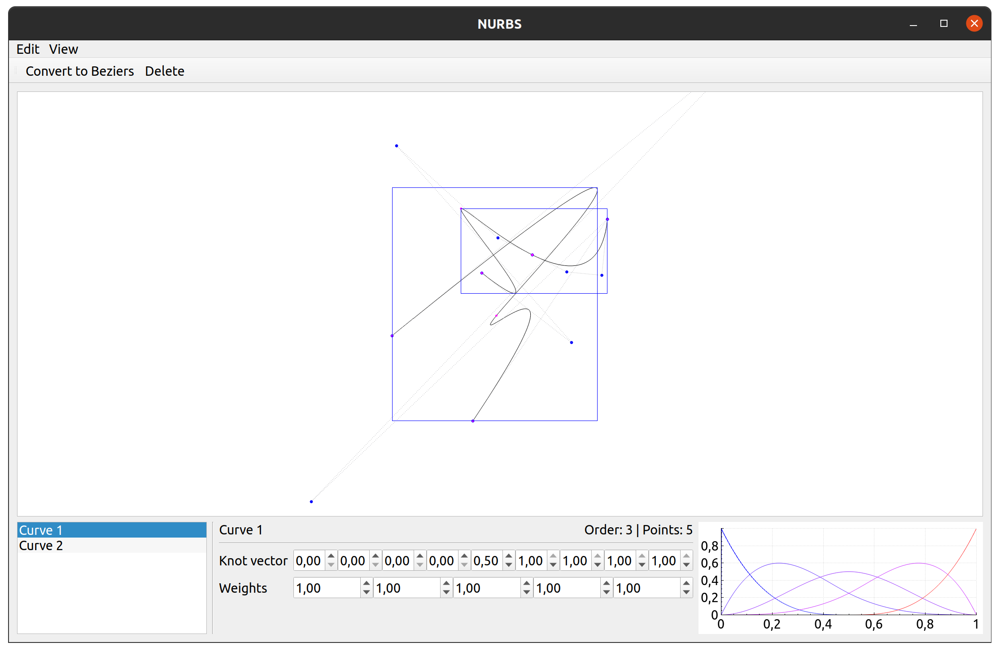

# NURBS
A C++ library for 2D NURBS curves.
The project includes an example program to demonstrate the library's features.

## Features

- Define and evaluate NURBS curves of any order
- Manipulate control points, weights and knot vectors
- Evaluate derivatives, tangents, point projections, curve length, curvature etc.
- Control point and knot insertion, knot refinement, curve splitting
- Piecewise linear representation for drawing
- And more :smile:

## Screenshots


## Dependencies
- The library requires Eigen 3.3 or higher (https://eigen.tuxfamily.org/)
- The example program is made using Qt5 (https://www.qt.io/download)

## Installation
```
git clone https://github.com/romb-technologies/Bezier
mkdir Bezier/build
cd Bezier/build
cmake ..
make
make install
```

## Licence
Apache License Version 2.0

---

Created at Romb Technologies (https://romb-technologies.hr/)
